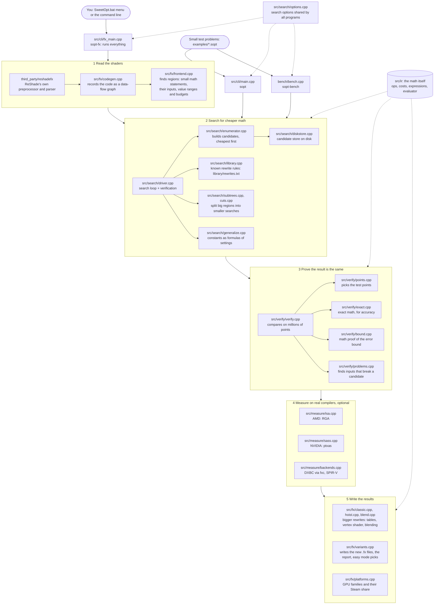

# Code map

Which file does what, and how a shader travels through SweetOpt. Use it to find the file to open
for a given job. (Details on the techniques: [technical.md](technical.md).)

## The big picture

Everything rests on `src/ir`: what an operation is, what it costs on each GPU, and how to compute it.

## Every file

### Programs (`src/cli`, `bench`)
| File | What it does |
|---|---|
| `src/cli/fx_main.cpp` | **sopt-fx**, the main program: reads effects, finds regions, searches them in parallel, uses the cache (`sopt-cache.txt`), measures, writes the output folder. Start here. |
| `src/cli/main.cpp` | **sopt**: searches one small problem from a `.sopt` file and prints the alternatives. Good for experiments. |
| `src/cli/console.cpp` | Title box, colors and progress bars in the terminal. |
| `bench/bench.cpp` | **sopt-bench**: runs the example and random problems to check that search changes help. |

### The math (`src/ir`)
| File | What it does |
|---|---|
| `src/ir/ops.cpp` | The table of operations (add, mul, sqrt, ...) and **what each costs on each GPU family** (cost models from OpBench). |
| `src/ir/expr.cpp` | Expressions as graphs: building, cost of a whole expression (incl. fused multiply-add), printing as HLSL / GLSL. |
| `src/ir/eval.cpp` | Computes an expression exactly like a GPU does in 32-bit floats (the reference). |
| `src/ir/parser.cpp` | Reads the `.sopt` text format (`input`, `output`, `budget`). |

### Search (`src/search`)
| File | What it does |
|---|---|
| `src/search/driver.cpp` | The search loop: find a candidate, verify it, learn from failures, repeat. Also the library pre-pass. |
| `src/search/enumerator.cpp` | Builds every expression from small to large, cheapest first, and spots matches. The heart of the search. |
| `src/search/options.cpp` | Command line options of the search, shared by sopt, sopt-fx and sopt-bench. |
| `src/search/library.cpp` | Applies known rewrite rules from `library/rewrites.txt`. |
| `src/search/subtrees.cpp` | Searches the small parts of a big expression on their own. |
| `src/search/cuts.cpp` | Splits an expression at a point everything depends on and searches both halves. |
| `src/search/generalize.cpp` | Turns found numbers back into formulas of the user's settings (e.g. a far plane). |
| `src/search/reshape.cpp` | Reorders sums and products so values that are the same for every pixel group together. |
| `src/search/diskstore.cpp` | Keeps candidates on disk (compressed) for very long searches. |

### Verification (`src/verify`)
| File | What it does |
|---|---|
| `src/verify/verify.cpp` | Runs original and candidate on many inputs and checks the difference is within the budget. |
| `src/verify/points.cpp` | Chooses the test inputs: edges, special values and random values. |
| `src/verify/exact.cpp` | The exact (double precision) value, to tell which version is more accurate. |
| `src/verify/bound.cpp` | Proves an upper bound on the error over a whole range (interval arithmetic). |
| `src/verify/problems.cpp` | Looks for single inputs where a candidate fails (e.g. a division by zero). |

### ReShade effects (`src/fx`)
| File | What it does |
|---|---|
| `src/fx/codegen.cpp` | Hooks into ReShade's parser and records the shader code as a data-flow graph. |
| `src/fx/frontend.cpp` | Loads an effect (HLSL / GLSL too), finds the regions, works out value ranges and budgets. |
| `src/fx/variants.cpp` | Writes the new effect files with switches, the report, `sopt-found.txt` and easy mode's picks. |
| `src/fx/classic.cpp` | Rewrite: local arrays of constants become static tables. Also shared source text helpers. |
| `src/fx/hoist.cpp` | Rewrite: moves math from the pixel shader to the vertex shader. |
| `src/fx/blend.cpp` | Rewrite: moves the final mix with the screen into the GPU's blend unit. |
| `src/fx/platforms.cpp` | The GPU families and their share of Steam users (weighs easy mode's choices). |

### Measurement (`src/measure`)
| File | What it does |
|---|---|
| `src/measure/isa.cpp` | Compiles variants with AMD's RGA (via fxstat) and counts instructions. |
| `src/measure/sass.cpp` | Compiles variants with NVIDIA's ptxas and counts instructions. |
| `src/measure/backends.cpp` | Checks what fxc (DirectX) and SPIR-V compilers already do on their own. |
| `src/measure/driverstats.cpp` | Reads instruction counts that a real driver reported (ShaderInfo round trip). |
| `src/measure/tools.cpp` | Shared helpers: run a command, temp folders, fold settings into constants. |

### Tests
| File | What it does |
|---|---|
| `tests/test_*.cpp` | One file per area (eval, parser, fx, library, accuracy, ...); `tests/fx/*.fx` are the test effects. |
| `tools/site/test_report_intake.py` | Checks the report intake script (run by CI). |

### Windows tools (`tools/windows`)
| File | What it does |
|---|---|
| `SweetOpt.bat`, `GPU-Blueprint.bat`, `Test-Host.bat` | The menus users double-click. |
| `opbench/`, `texbench/`, `shaderinfo/` | **GPU Blueprint**: measures math costs, texture costs and driver info of a graphics card. |
| `host/sopt_host.cpp` | **Test Host**: shows a fixed image on any graphics API so ReShade can run without a game. |
| `timer/sopt_timer.cpp` | ReShade add-on that times effects on the GPU. |
| `run-test.ps1`, `run-bench.ps1`, `common.ps1` | Scripts behind Test-Host.bat. |
| `stage.ps1`, `zip-reports.ps1` | Put the release folders together; zip the GPU Blueprint reports. |
| `gen_expected.py` → `expected.hpp` | Expected results per GPU family, so OpBench can flag odd measurements. |
| `docs/*.html` | The guides shipped with GPU Blueprint and Test Host. |

### Other tools
| File | What it does |
|---|---|
| `tools/fxc/sopt_fxc.c` | Small wrapper around Microsoft's shader compiler (fxc). |
| `tools/site/build.py` | Builds the web site (`site/`) from the reports. |
| `tools/site/report_intake.py` | Fetches GPU Blueprint reports from Dropbox (run by a GitHub Action). |
| `tools/site/steam_share.py` | Updates the Steam GPU shares (`data/steam-gpu-share.txt`). |
| `tools/site/optimize_pngs.py` | Compresses report pictures. |
| `tools/reshade/` | Patches and tests for ReShade itself (IEEE 754 test effect). |
| `tools/sweetfx/` | Proposed SweetFX changes. |

### Data
| Folder | What it holds |
|---|---|
| `docs/opbench`, `docs/texbench`, `docs/shaderinfo` | GPU Blueprint reports from testers' cards. |
| `library/rewrites.txt` | Known rewrite rules (readable by people and the program). |
| `examples/*.sopt` | Small test problems for sopt and the bench. |
| `data/steam-gpu-share.txt` | Share of Steam users per GPU family. |
| `third_party/` | ReShade's FX compiler (with small hooks) and zstd. |

### GitHub Actions (`.github/workflows`)
| File | What it does |
|---|---|
| `ci.yml` | Builds and tests on every push (Windows, Linux) and makes the downloads. |
| `release.yml` | Makes a draft release (started by hand). |
| `report-intake.yml` | Every 6 hours: fetches new GPU Blueprint reports from Dropbox. |
| `pages.yml` | Builds the web site. |
| `steam-survey.yml` | Updates the Steam GPU shares. |
| `optimize-pngs.yml` | Compresses new report pictures. |
| `reshade.yml` | Builds ReShade (unchanged and patched) for the tools. |
